# DevOps Week 1

## Inhaltsverzeichnis
- [Person & IT-Know-How](#person--it-know-how)  
- [Bezug zu DevOps & Motivation](#bezug-zu-devops--motivation)  
- [Verwendete Hardware / Betriebssystem](#verwendete-hardware--betriebssystem)  
- [Einführung und Installation Software](#einführung-und-installation-software)  

## Person & IT-Know-How

Ich bin Michael Bock, 28 Jahre alt, und habe meinen Bachelor in Wirtschaftsinformatik an der ZHAW abgeschlossen. Während meines Studiums konnte ich fundierte Kenntnisse im Bereich IT und Wirtschaft aufbauen, die ich nun täglich in meinem Berufsalltag anwende.

Aktuell arbeite ich als Solution Engineer bei Finnova, einem Unternehmen, das Softwarelösungen für Banken entwickelt und vertreibt. In meiner Rolle bin ich regelmässig mit verschiedenen Technologien und Tools im Einsatz. Dazu gehören vor allem:

- Git für Versionskontrolle
- Camunda Engine zur Modellierung und Automatisierung von Geschäftsprozessen
- BPMN für Prozessmodellierung
- JavaScript und Groovy für Skripting und Automatisierungen
- Java (gelegentlich)
- Weitere Technologien, je nach Projektanforderung

Neben meiner beruflichen Tätigkeit habe ich auch privat IT-Projekte verfolgt. So habe ich beispielsweise mit der Unity Game Engine kleine Computerspiele in C# entwickelt, wodurch ich meine Kenntnisse im Bereich der Spieleentwicklung erweitern konnte.

## Bezug zu DevOps & Motivation

In meiner aktuellen Rolle als Solution Engineer bei Finnova arbeite ich regelmässig mit Tools und Methoden, die eng mit DevOps-Praktiken verbunden sind, wie z. B. Git für Versionskontrolle sowie Camunda und BPMN für Prozessautomatisierung. Dennoch sehe ich Potenzial, mein Wissen über DevOps-Konzepte wie Continuous Integration/Continuous Deployment (CI/CD), Automatisierung und Zusammenarbeit zwischen Entwicklung und Betrieb weiter zu vertiefen.

Meine Motivation für dieses Modul ist es, ein besseres Verständnis für die DevOps-Philosophie zu entwickeln und Best Practices kennenzulernen, um effizientere Entwicklungs- und Bereitstellungsprozesse zu unterstützen. Zudem möchte ich mein technisches Wissen erweitern, um komplexe Workflows besser integrieren und automatisieren zu können.

## Verwendete Hardware / Betriebssystem

- **Betriebssystem:** Windows 11
- **Prozessor:** 13th Gen Intel® Core™ i9-13900H, 2.6 GHz, 14 Kerne, 20 logische Prozessoren
- **Arbeitsspeicher:** 32 GB RAM
- **Grafikkarte:** NVIDIA GeForce RTX 4050 Laptop GPU, 6 GB VRAM

## Einführung und Installation Software

1. Als erstes habe ich mich in meinen Github-Account angemeldet und eine Repo erstellt mit dem Namen **DevOps_Week1**. Da ich bereits Git auf meinem Computer installiert habe, 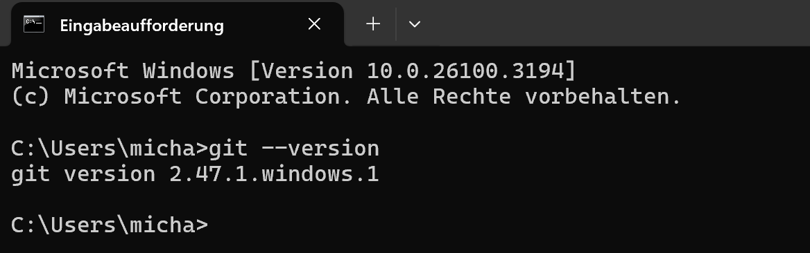, konnte ich die Repo mit der **README.md**-Datei auf meinen Rechner clonen.

2. Auch JDK Version 21 hatte ich bereits auf meinem Computer installiert (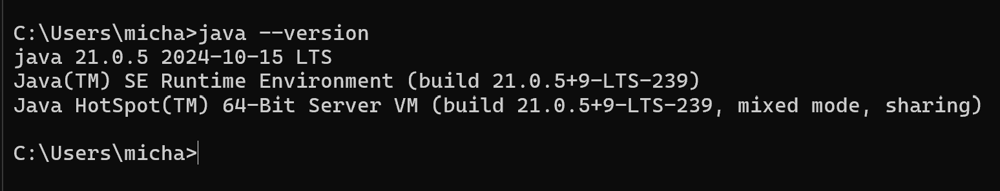).

3. Gradle habe ich ebenfalls bereits auf dem Computer installiert, da ich dieses für private Projekte und fürs Studium verwendet habe (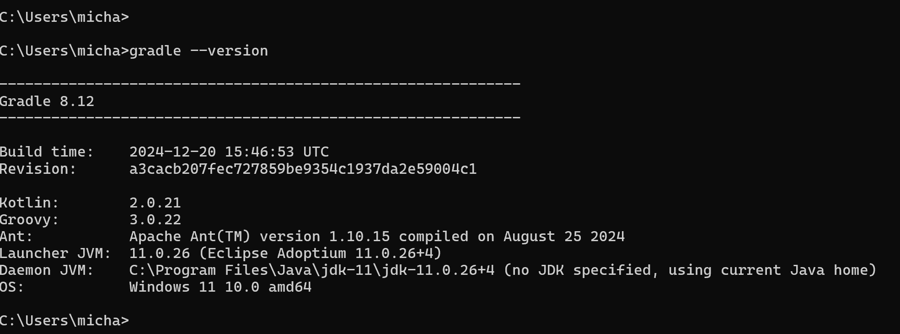).

4. Gradle und JAVA_HOME habe ich bereits als Umgebungsvariablen definiert ().

5. Auf folgendem Screenshot sind alle Extensions ersichtlich:
   - 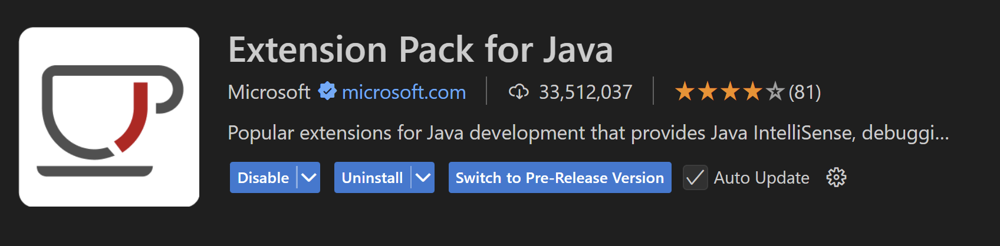
   - 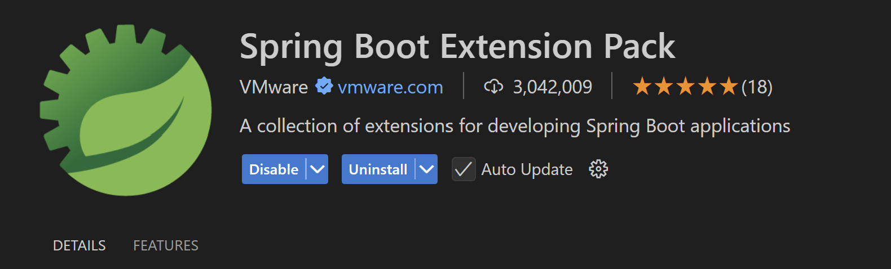
   - 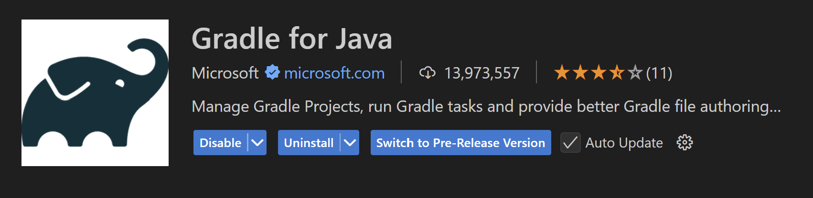
   - 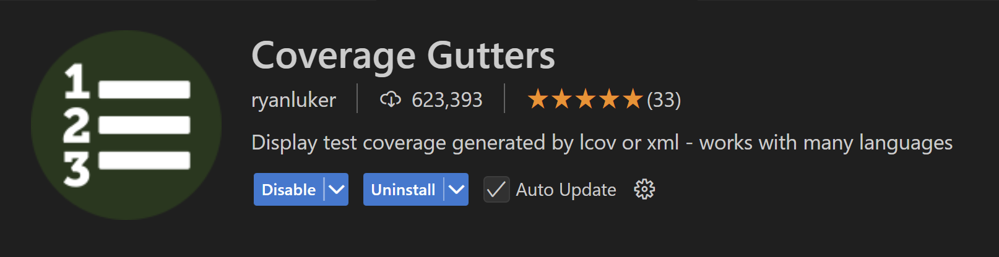
   - 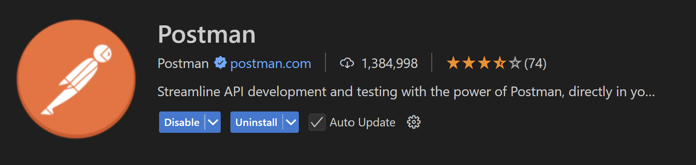

6. NPM war auch bereits auf meinem Computer installiert: 

7. Die Selenium Extension habe ich auf Firefox installiert: 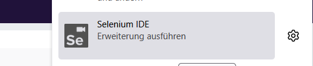

8. Docker Desktop wurde installiert: 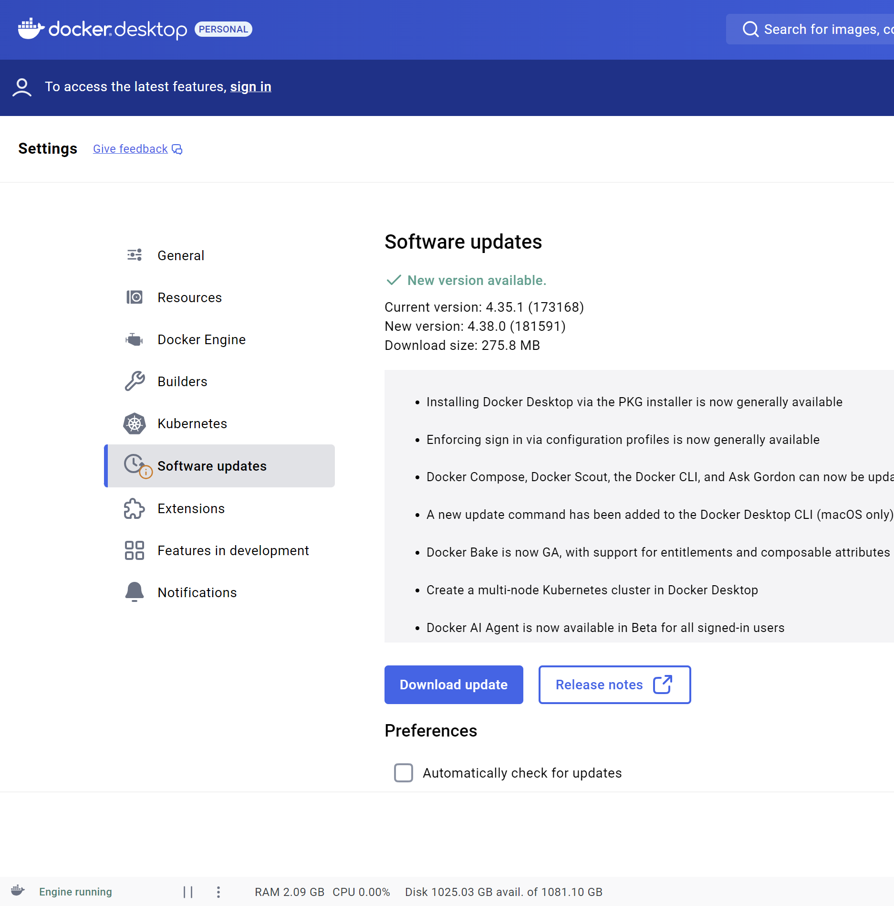

9. Ich habe das Jenkins Image heruntergeladen, den Container gestartet und mich auf dem Localhost angemeldet: 

10. Ich habe das SonarQube Image heruntergeladen, den Container gestartet und mich auf dem Localhost angemeldet: 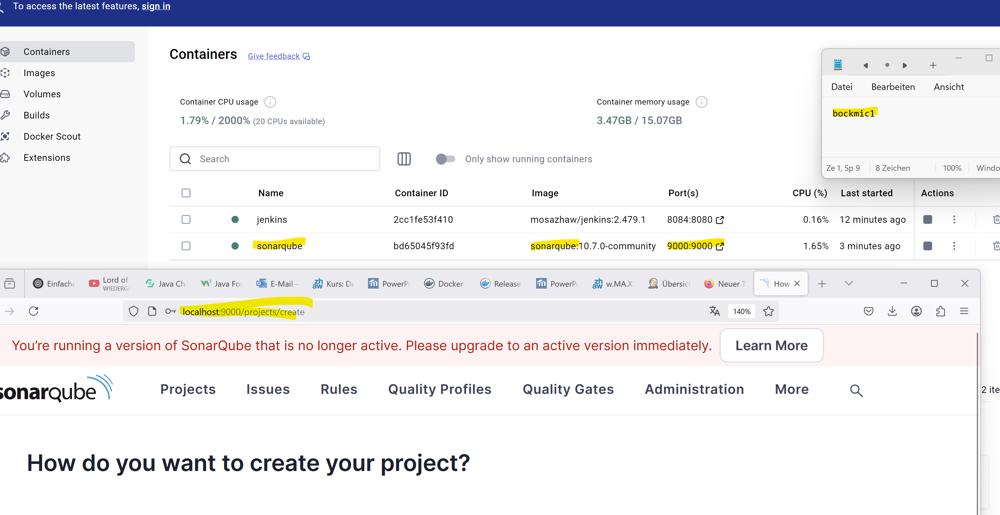

11. Als nächstes habe ich mich auf Azure angemeldet und das Student Starter Abo abonniert: 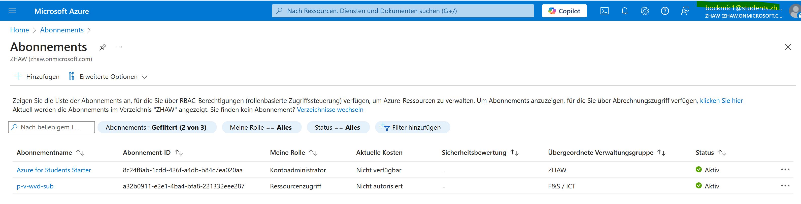, 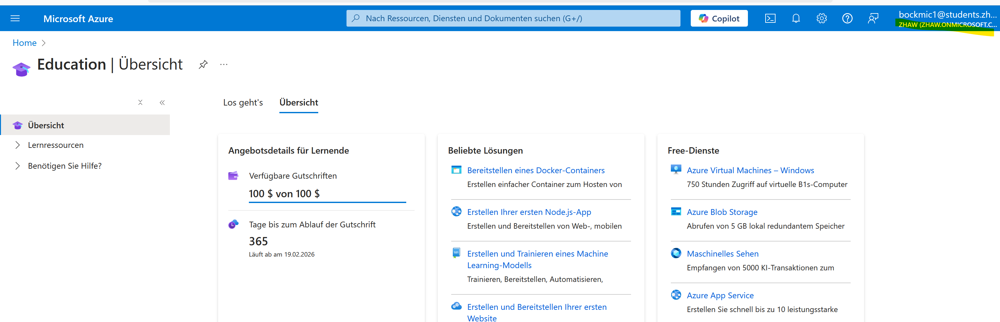.

12. Der Azure CLI wurde installiert und geprüft, ob der Login funktioniert und ob die Subscription richtig eingestellt wurde: 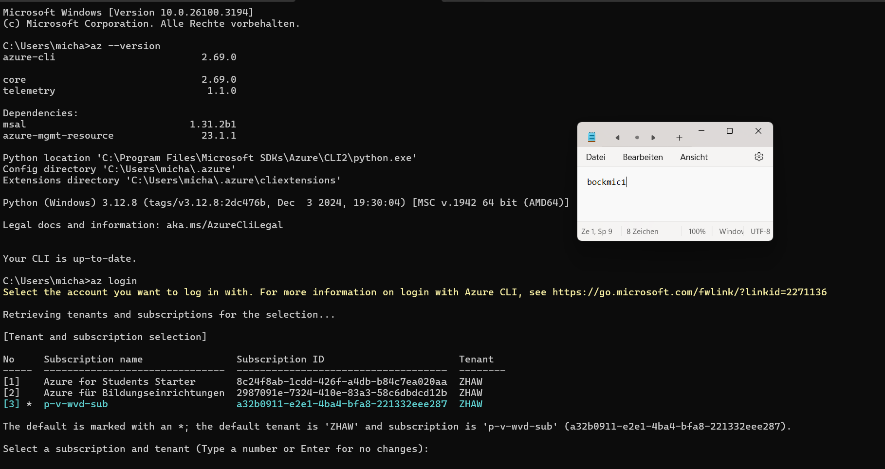

13. Letztlich habe ich mich auf Postman angemeldet: 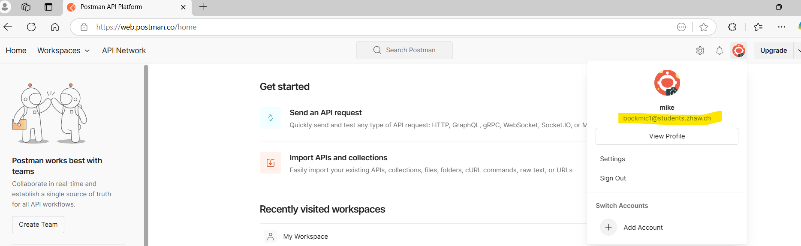
