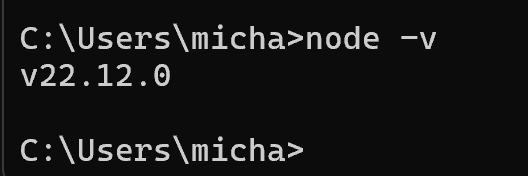

# DevOps_Week1
Einführung und Installation Software

1. Als erstes habe ich mich in meinen Github-Account angemeldet und eine Repo erstellt mit dem Namen DevOps_Week1. da ich bereits git auf meinem computer installiert habe, , konnte ich bereits die Repo mit der README.md-Datei auf meinen Rechner Clonen. 

2. Auch JDK Version 21 hatte ich bereits auf meinem Computer ().

3. Gradle habe ich bereits auf dem Computer installiert, da ich dieses für private Projekte und fürs Studium bereits verwendet habe ().

4. Gradle und JAVA_HOME habe ich bereits als Umgebungsvariablen definiert ().

5. Auf folgenden Screenshot sind alle Extensions ersichtlich: , , , , ,

6. NPM war auch bereits auf meinem Computer installiert:  

7. Die Selenium Extension habe ich auf Firefox installiert: 

8. Docker Desktop wurde installiert: 

9. Ich habe das Jenkins Image heruntergeladen, den Container gestartet und mich auf dem Localhost angemeldet: 

10. Ich habe das sonarQube Image heruntergeladen, den Container gestartet und mich auf dem Localhost angemeldet: 

11. Als nächstes habe ich mich auf Azure angemeldet und das student starter Abo aboniert: [AzureAbo](images/AzureAbo.png), [AzureCredit](images/AzureCredit.png).

12. Der Azure CLI wurde installiert und geprüft, ob login funktioniert und ob die Subscription richtig eingestellt wurden: [azureCli](images/azureCli.png)

13. letztlich habe ich mich auf Postman angemeldet: [Postman Login](images/PostmanLogin.png) 